# HR Onboarding Agent - HLD (High Level Document)

**Document Version Control**

| Version | Date       | Author   | Change Description                                      |
|---------|------------|----------|--------------------------------------------------------|
| 1.0     | 2025-11-25 | Md Sahil | Initial draft, including introduction and system overview sections. |
| 2.0     | 2025-12-30 | Md Sahil | Updated recruitment flow with QR code check-in, dual candidate paths, background verification, and Form-4 onboarding. |

---

## Table of Contents

1. [Introduction](#1-introduction)
2. [Recruitment Process Flow](#2-recruitment-process-flow)
3. [System Overview](#3-system-overview)
4. [Infrastructure Architecture](#4-infrastructure-architecture)
5. [Technology Stack](#5-technology-stack)
6. [User Roles & Access Hierarchy (RBAC)](#6-user-roles--access-hierarchy-rbac)
7. [Architecture Design](#7-architecture-design)
8. [Module Descriptions](#8-module-descriptions)
9. [Data Design](#9-data-design)
10. [Deployment Architecture](#10-deployment-architecture)
11. [Compliance & Data Retention](#11-compliance--data-retention)
12. [Risks & Mitigations](#12-risks--mitigations)
13. [Success Metrics & KPIs](#13-success-metrics--kpis)
14. [HR Recruitment Process Flow](#14-hr-recruitment-process-flow)

---

## 1. Introduction

### 1.1 Purpose

The **HR Onboarding Agent Project** aims to digitize and automate the end-to-end **recruitment and onboarding process** for Sampurna Financial Services Pvt. Ltd. (SFSPL).

#### ❌ Previous Challenges

**Manual Process Issues:**
- ❌ Data loss and duplication
- ❌ Delayed and unstructured communication
- ❌ Limited visibility on candidate progress
- ❌ No track of interview lifecycle
- ❌ No scope for analysis
- ❌ Manual handling via WhatsApp, Excel sheets, and emails

#### ✅ Solution Objectives

**Centralized Digital System Benefits:**
- ✅ Secure storage of all candidate and interview data
- ✅ Automated screening, evaluation, scheduling, and tracking
- ✅ Real-time visibility of onboarding progress
- ✅ Reduced manual dependency and enhanced HR efficiency
- ✅ Interview process and quality analysis

#### 📑 Problem Statement

The current employee onboarding process is highly manual and lacks digital structure. Candidates send CVs via WhatsApp, HR contacts them for preliminary questions, and interviews are conducted offline. Information is not systematically recorded, resulting in:

- No centralized or organized database
- Only mandatory details entered into HRMS
- Significant data loss and inefficiency
- Difficulty tracking and analyzing recruitment trends

### 1.2 🎯 Scope

#### ✅ In Scope
- Candidate registration & digital forms (Form-1 to Form-4)
- Interview scheduling & panel allocation
- Profile, document & KYC management
- Onboarding checklist & task tracking
- Email & WhatsApp notifications (via n8n)
- PostgreSQL centralized database
- Multilingual interface (English, Hindi, Bengali)
- Analysis & Reporting
- QR-based check-in at interview venue
- Background verification workflow
- Offer letter generation and delivery

#### ❌ Out of Scope
- Full automation for background verification (manual process in Phase-1)
- Direct integration with Octane (data export to Octane)
- Auto mail from HR mailbox (managed via n8n)
- Auto selection of candidates (HR-driven decisions)

---

## 2. Recruitment Process Flow

### 📊 Updated Recruitment Process Flow Diagram (with QR Check-in & Dual Paths)

```mermaid
graph TD
    A["🎯 Vacancy<br/>Identification"] --> B["📱 WhatsApp<br/>Campaign"]
    B --> C["📝 CV<br/>Submission"]
    C --> D["📋 Form-1<br/>Basic Details"]
    D --> E{"✅ Eligibility<br/>Check"}
    E -->|Fail| F["❌ Rejected"]
    E -->|Pass| G["📅 Interview<br/>Scheduled"]
    G --> H["🏢 Interview<br/>Day - QR Check-in"]
    
    H --> I{"Candidate<br/>Type?"}
    I -->|Screened| J["📋 Form-2<br/>Link Only"]
    I -->|Walk-in| K["📋 Form-1 +<br/>Form-2 Links"]
    
    J --> L["📋 Complete<br/>Form-2"]
    K --> M["📋 Complete<br/>Form-1 + Form-2"]
    
    L --> N["🎤 Interview<br/>Evaluation"]
    M --> N
    
    N --> O["📋 Form-3<br/>Submission"]
    O --> P{"Selection<br/>Decision"}
    P -->|Rejected| F
    P -->|Selected| Q["🔍 Background<br/>Verification"]
    
    Q --> R["📤 Data Upload<br/>to HRMS/Octane"]
    R --> S["📄 Offer Letter<br/>Generation"]
    S --> T["📧 Offer Sent<br/>to Candidate"]
    T --> U["🏢 Candidate<br/>Joins - Induction"]
    U --> V["📋 Form-4<br/>Onboarding"]
    V --> W["🎉 Onboarding<br/>Complete"]
    
    style A fill:#e3f2fd
    style B fill:#e3f2fd
    style C fill:#e3f2fd
    style D fill:#e3f2fd
    style E fill:#fff3e0
    style F fill:#ffcdd2
    style G fill:#f3e5f5
    style H fill:#f3e5f5
    style I fill:#fff3e0
    style J fill:#e3f2fd
    style K fill:#e3f2fd
    style L fill:#e3f2fd
    style M fill:#e3f2fd
    style N fill:#f3e5f5
    style O fill:#f3e5f5
    style P fill:#fff3e0
    style Q fill:#fff9c4
    style R fill:#fff9c4
    style S fill:#c8e6c9
    style T fill:#c8e6c9
    style U fill:#c8e6c9
    style V fill:#c8e6c9
    style W fill:#a5d6a7
```



**[Diagram 1: Complete Recruitment Flow with QR Check-in, Dual Candidate Paths, Background Verification & Onboarding]**

---

### 2.1 Data Flow Diagram

#### Level-0: System Context

```mermaid
graph TB
    subgraph entities["External Entities"]
        direction LR
        CAND["👤 CANDIDATE"]
        HR["👥 HR TEAM"]
        INT["🎤 INTERVIEWER"]
    end
    
    subgraph system["System"]
        PROCESS["🎯 HR ONBOARDING<br/>AGENT SYSTEM<br/>Process 0.0"]
    end
    
    subgraph datastores["Data Stores"]
        direction TB
        D1["D1: CANDIDATE_DATABASE"]
        D2["D2: APPLICATION_DATA"]
        D3["D3: INTERVIEW_RECORDS"]
        D4["D4: DOCUMENTS_STORAGE"]
        D5["D5: AUDIT_LOGS"]
    end
    
    CAND -->|1.1 Application Form| PROCESS
    HR -->|2.1 Review & Decision| PROCESS
    HR -->|2.2 Reports & Analytics| PROCESS
    INT -->|3.1 Evaluation| PROCESS
    
    PROCESS -->|Store Data| D1
    PROCESS -->|Store Data| D2
    PROCESS -->|Store Data| D3
    PROCESS -->|Store Data| D4
    PROCESS -->|Store Data| D5
```



**[Diagram 2: Data Flow Level-0]**


---


#### Level-1: Detailed Processes

- **Process 1:** Candidate Registration (Forms 1-4)
- **Process 2:** Interview Scheduling & QR Check-in Management
- **Process 3:** Background Verification & Decision Notification
- **Process 4:** Offer Generation & Delivery
- **Process 5:** Onboarding Task Tracking & Form-4 Completion
- **Process 6:** Analytics & Reporting


**[Diagram 3: Data Flow Level-1]**


#### 📋 Color Coding

| Color | Element | Meaning |
|-------|---------|---------|
| 🟠 **Orange** | External Entities | Candidate, HR, Interviewer |
| 🔵 **Blue** | Processes (1.0-8.0) | Main business operations |
| 🔴 **Red** | Process 6.0 + D5 | Critical: Background Verification |
| 🟣 **Purple** | Data Stores (D1-D8) | Databases & storage |


---


### 2.2 Technology Stack and Architecture

**Core Technology Stack:**


**[Diagram 4: Technology Stack Architecture - Updated with QR Service]**

---

### 2.3 👥 Target Audience

| Role | Responsibilities |
|------|------------------|
| HR & Business Users | Process owners, approvers, end users, interview coordination |
| System Architects | Review system components and overall architecture |
| Developers | Implement modules based on design |
| Database Administrators | Maintain PostgreSQL/Supabase schema and data integrity |
| Security & Compliance Team | Verify encryption, access control, and data retention |
| IT & DevOps Team | Manage deployment, monitoring, and version control |
| Management / Stakeholders | Approve scope, KPIs, and release milestones |


---

## 3. 🌐 System Overview

### 3.1 System Overview

The **HR Onboarding Agent** serves as a **web-based digital platform** that connects candidates, recruiters, and HR teams in one centralized ecosystem.

**Key Platform Features:**
- Streamlit-based user interfaces for candidates and HR
- FastAPI backend for business logic and API services
- PostgreSQL database for centralized data storage
- n8n automation for notifications and workflow triggers
- Supabase storage for documents and file management
- QR-based check-in system for interview venues

**[Diagram 5: System Architecture Overview]**

```mermaid
graph TB
    CP["👥 Candidate Portal<br/>Streamlit 8501"]
    HP["📊 HR Dashboard<br/>Streamlit 8502"]
    API["⚡ FastAPI<br/>Backend<br/>Port 8000"]
    QR["🎫 QR Service<br/>Venue Check-in"]
    DB["🗄️ PostgreSQL<br/>Supabase"]
    STORAGE["📦 Supabase<br/>Storage"]
    N8N["🔄 n8n<br/>Automation"]
    
    CP -->|HTTPS| API
    HP -->|HTTPS| API
    QR -->|HTTPS| API
    API -->|CRUD| DB
    API -->|Files| STORAGE
    API -->|Webhooks| N8N
    
    style CP fill:#e3f2fd
    style HP fill:#f3e5f5
    style QR fill:#ffe0b2
    style API fill:#fff3e0
    style DB fill:#c8e6c9
    style STORAGE fill:#fce4ec
    style N8N fill:#f1f8e9
```



### 3.2 🎯 Key Objectives

| Category | Objective | Outcome |
|----------|-----------|---------|
| Business | Eliminate manual WhatsApp/Excel-based tracking | Improved process reliability |
| Business | Reduce HR workload through automation | 60% less manual data handling |
| Business | Interview efficiency analysis | Helps understand interview quality |
| Technical | Store all data digitally | PostgreSQL-based centralized DB |
| Technical | Integrate automated notifications | Improved candidate communication |
| Operational | Track onboarding progress | Transparent HR reporting dashboard |
| Operational | Secure interview venue access | QR-based check-in with audit trail |
| Operational | Automated offer generation | Faster offer delivery pipeline |

---

## 4. Infrastructure Architecture

### 4.1 Hosting Environment

The HR Onboarding Agent is hosted on a **Hostinger VPS** and follows a **Docker-based deployment model** for isolation, scalability, and simplified maintenance.

| Component | Environment | Purpose |
|-----------|-------------|---------|
| FastAPI Backend | VPS (Ubuntu 22.04) | Core business logic and API services |
| Streamlit Frontend | VPS | HR and Candidate user interfaces |
| QR Service | VPS | QR code generation and validation |
| PostgreSQL (Supabase) | VPS | Centralized database for recruitment and onboarding |
| n8n Automation | Internal Docker Service | Notification handling (Email, SMS, WhatsApp) |
| Blob Storage (Supabase) | VPS | Secure file storage for resumes, offers, KYC |

### 4.2 🔒 Security & Networking

#### Security Measures
- ✅ HTTPS enforced (TLS 1.2+) with Let's Encrypt SSL
- ✅ Firewall rules restrict access to ports 80, 443, 22
- ✅ Role-based access control (RBAC)
- ✅ QR codes with expiry and single-use validation
- ✅ Daily backups with 30-day retention

#### Network Architecture
- API and database communicate via private network
- TLS at each application layer
- JWT authentication
- Optional DB Row-Level Security (RLS)

### 4.3 📐 Logical Topology

```mermaid
graph TB
    subgraph "Client Layer"
        CP["👥 Candidate Portal<br/>Streamlit 8501<br/>HTTPS"]
        HP["📊 HR Dashboard<br/>Streamlit 8502<br/>HTTPS"]
        QR_CLIENT["📱 QR Scanner<br/>Mobile/Tablet<br/>HTTPS"]
    end
    
    subgraph "API Layer"
        API["⚡ FastAPI<br/>Port 8000 HTTPS<br/>RBAC, Validation"]
        QR_API["🎫 QR Service<br/>Generate & Validate<br/>HTTPS"]
    end
    
    subgraph "Data Layer"
        DB["🗄️ PostgreSQL<br/>Supabase<br/>Private Network"]
        STORAGE["📦 Supabase Storage<br/>Signed URLs"]
    end
    
    subgraph "Automation"
        N8N["🔄 n8n<br/>Private<br/>Webhooks"]
    end
    
    subgraph "Security"
        TLS["🔐 TLS 1.3<br/>JWT Auth<br/>Firewall"]
    end
    
    CP -->|HTTPS| API
    HP -->|HTTPS| API
    QR_CLIENT -->|HTTPS| QR_API
    QR_API -->|HTTPS| API
    API -->|Private| DB
    API -->|Private| STORAGE
    API -->|Private| N8N
    TLS -->|Protects| API
    
    style CP fill:#e3f2fd
    style HP fill:#f3e5f5
    style QR_CLIENT fill:#ffe0b2
    style API fill:#fff3e0
    style QR_API fill:#ffe0b2
    style DB fill:#c8e6c9
    style STORAGE fill:#fce4ec
    style N8N fill:#f1f8e9
    style TLS fill:#ffcdd2
```



**[Diagram 6: Logical Topology with QR Service]**

---

## 5. Technology Stack

### 5.1 Stack Components

| Layer | Primary Technology | Why Chosen | Notes |
|-------|-------------------|-----------|-------|
| Frontend & UI | Streamlit (Python) | Fast internal apps, form-heavy UI, minimal JS | Candidate Portal, HR Dashboard |
| Backend | FastAPI (Python) & n8n | High-performance async APIs, Pydantic validation, OpenAPI | Service layer + auth + business rules |
| QR Service | FastAPI + qrcode library | Fast QR generation & validation, integrates with FastAPI | Interview venue check-in |
| Database | PostgreSQL (Supabase) | ACID, JSONB, solid indexing, easy backups | RLS-ready; UUID keys; audit tables |
| Storage | Supabase Storage | Signed URLs & lifecycle policies | Resumes, KYC, offer PDFs |
| Containerization | Docker Compose | Environment parity, reproducible builds | DEV/UAT/PROD |
| BI & Dashboards | Python (pandas + Plotly) | Quick analytics & exports | Runs inside HR Dashboard |
| Version Control | Git / GitHub | PR reviews, issues, Actions CI | Branch policy: main protected |

### 5.2 Component-to-Tool Mapping


### 5.3 🔒 Security Baselines

#### Authentication
- JWT (access/refresh tokens)
- Bcrypt passwords for HR users
- OTP for candidates
- QR expiry validation (15-30 min)

#### Data Protection
- TLS on all endpoints
- Signed URLs for files
- Least-privilege DB roles
- QR code encryption in transit

### 5.4 CI/CD Overview (GitHub)

```
Lint → Tests → Build Docker Images
         ↓
Push to Registry → Remote Docker Compose Up
         ↓
Alembic Upgrade → Smoke Tests → Production
```

**Branches:** `feature` → `PR` → `main` (protected)

### 5.5 🔮 Future Enhancements

#### ✨ Planned Features
- Streamlit component polish
- WhatsApp chatbot with map facilities
- Maximize automation
- Automated background verification service
- Direct HRMS/Octane API integration

#### 🎯 Strategic Goals
- Ensure Security & Compliance
- Make it sellable as product
- Phase-2: Full automation layer

---

## 6. User Roles & Access Hierarchy (RBAC)

### 6.1 Role Catalog (Least-Privilege)

| Role | Responsibilities |
|------|------------------|
| Super Admin | User provisioning, environment/config toggles, audit access |
| HR Manager | Approvals, final decisions, reports, background verification oversight |
| Recruiter | Intake, screening, schedule interviews, QR management, draft updates |
| Interviewer | View assigned candidates, submit Form-3 only, QR check-in validation |
| Background Verifier | Review background checks, update verification status |
| Compliance/Audit | Read-only to audit logs/reports, QR access logs |
| Candidate | Own profile/forms/documents; track status, ask questions through chatbot |

### 6.2 🔐 Permission Snapshot (CRUD + Approvals)

```mermaid
graph TD
    SA["👑 Super Admin<br/>User Provisioning<br/>Config Management"]
    HRM["👔 HR Manager<br/>Approvals<br/>Final Decisions<br/>Reports"]
    REC["🔍 Recruiter<br/>Screening<br/>QR Management<br/>Scheduling"]
    INT["👨‍💼 Interviewer<br/>Form-3 Only<br/>QR Validation"]
    BV["🔐 Background Verifier<br/>BG Check Status<br/>Verification"]
    AUDIT["📋 Compliance/Audit<br/>Read-Only Access"]
    CAND["👤 Candidate<br/>Self-Profile<br/>Status Tracking"]
    
    SA -->|Manages| HRM
    SA -->|Manages| REC
    SA -->|Manages| INT
    SA -->|Manages| BV
    HRM -->|Reviews| REC
    HRM -->|Supervises| INT
    HRM -->|Approves| BV
    HRM -->|Communicates| CAND
    REC -->|Creates QR| INT
    REC -->|Engages| CAND
    INT -->|Validates QR| CAND
    INT -->|Evaluates| CAND
    BV -->|Updates Status| HRM
    AUDIT -->|Monitors All|SA
    
    style SA fill:#ffebee
    style HRM fill:#fff3e0
    style REC fill:#e3f2fd
    style INT fill:#f3e5f5
    style BV fill:#fff9c4
    style AUDIT fill:#fce4ec
    style CAND fill:#e8f5e9
```



### 6.3 📋 Data Scope & Session Policy

| Aspect | Policy |
|--------|--------|
| Scope | Candidate=self; Interviewer=assigned_only; Recruiter=branch/assigned; HR Manager=department/global; Background Verifier=assigned list |
| HR Sessions | 8h session (2h idle timeout) + optional MFA for managers |
| Candidate Sessions | 24h session with OTP authentication |
| QR Sessions | Single-use, 15-30 min expiry, logged access with timestamp |
| RLS (Optional) | Policies by candidate_id, branch, or assignment in Supabase |

---

## 7. Architecture Design

### 7.1 🧩 Components

```mermaid
graph TB
    subgraph "Core Modules"
        CM["📝 Candidate Module<br/>Registration, Forms 1-4"]
        HM["👔 HR Module<br/>Screening, Scheduling"]
        IM["🎤 Interview Module<br/>QR Check-in, Form-3"]
        OM["✅ Onboarding Module<br/>Checklist, Tasks, Form-4"]
        BVM["🔍 Background Verification Module<br/>Status Tracking"]
    end
    
    subgraph "Support Modules"
        AUTH["🔐 Auth Module<br/>JWT, OTP, RBAC"]
        QRM["🎫 QR Module<br/>Generation, Validation, Logging"]
        NOTIF["📧 Notification Module<br/>Email, SMS, WhatsApp"]
        ANALYTICS["📊 Analytics Module<br/>Dashboards, Reports"]
        AUDIT["📋 Audit Module<br/>Logging, Compliance"]
    end
    
    CM -->|Uses| AUTH
    HM -->|Uses| AUTH
    IM -->|Uses| AUTH
    OM -->|Uses| AUTH
    BVM -->|Uses| AUTH
    
    CM -->|Triggers| NOTIF
    HM -->|Triggers| NOTIF
    IM -->|Triggers| NOTIF
    BVM -->|Triggers| NOTIF
    OM -->|Triggers| NOTIF
    
    HM -->|Generates| QRM
    IM -->|Validates| QRM
    
    CM -->|Logs| AUDIT
    HM -->|Logs| AUDIT
    IM -->|Logs| AUDIT
    BVM -->|Logs| AUDIT
    OM -->|Logs| AUDIT
    QRM -->|Logs| AUDIT
    
    style CM fill:#e3f2fd
    style HM fill:#fff3e0
    style IM fill:#f3e5f5
    style OM fill:#c8e6c9
    style BVM fill:#fff9c4
    style AUTH fill:#ffe0b2
    style QRM fill:#ffccbc
    style NOTIF fill:#f1f8e9
    style ANALYTICS fill:#eceff1
    style AUDIT fill:#fce4ec
```



### 7.2 🔄 Component Interactions

| Step | Interaction |
|------|-------------|
| Step 1 | Candidate opens Streamlit Form → Provides mobile number → FastAPI verifies conditions → Redirects to form |
| Step 2 | Forms post JSON → FastAPI validates → Writes to PostgreSQL |
| Step 3 | File uploads → FastAPI requests signed URL → Streamlit uploads to Supabase Storage |
| Step 4 | HR actions (screening, scheduling, decisions) → FastAPI/n8n updates DB → Triggers automation webhooks |
| Step 5 | QR generation → Recruiter creates QR for interview → HR dashboard displays QR |
| Step 6 | Candidate scans QR at venue → QR validation → Forms loaded based on candidate type |
| Step 7 | Background verification → Status updated in DB → n8n triggers offer generation |
| Step 8 | Dashboards/analytics → Streamlit queries DB views for read-only data |

### 7.3 📊 Sequence Diagram (Complete Happy Path with QR & Onboarding)


---

## 8. Module Descriptions

### 📝 8.1 Candidate Management

**What it does:**
Mobile number based login, Form-1 (basic), Form-2 (details), document uploads, status tracking.

**Key Flows:**
1. WhatsApp "Hi" → Form-1 link → Eligibility check (number + 30-day rule)
2. Form-1 upsert personal_details + insert candidate_applications
3. Form-2 writes addresses, qualifications, skills, documents
4. Form-4 writes remaining onboarding details post-induction

**UI:** Streamlit forms + status timeline

---

### 👔 8.2 HR Management

**What it does:**
Screening, shortlist/reject, interview scheduling (date/time/location), QR generation, offer decision gate.

**Key Features:**
- QR code generation for interview venues
- Background verification status tracking
- Offer letter management
- Onboarding checklist creation

**Notes:**
Scheduling updates are the trigger-point for automation to send invites + QR codes.

---

### 🎤 8.3 Interview Management

**What it does:**
QR check-in at venue, Form-2/Form-3 access based on candidate type, evaluation (ratings + remarks).

**Rules:**
1. Candidate scans QR → System validates expiry & single-use
2. If screened candidate → Form-2 link provided
3. If walk-in candidate → Form-1 + Form-2 links provided
4. Interviewer loads Form-3 by candidate mobile; writes interview_evaluations, updates application status.

**Audit:**
All QR validations logged with timestamp, IP, and status.

---

### 🔍 8.4 Background Verification Module

**What it does:**
Tracks background verification status post-selection, updates candidate application status, triggers offer generation.

**Key Flows:**
1. HR starts BG verification → Status = 'in_progress'
2. HR completes BG verification → Status = 'cleared' or 'failed'
3. If cleared → Trigger offer letter generation
4. If failed → Candidate notified, application closed

**Mechanism:**
FastAPI updates bg_verification record → n8n triggers offer generation → Email sent

---

### 📄 8.5 Offer Letter Generation

**What it does:**
Post-BG verification: Generates offer letter PDF, stores in Supabase, sends via email to candidate.

**Triggers:**
- Background verification completed with cleared status

**Mechanism:**
FastAPI generates PDF → Uploads to Supabase Storage → Gets signed URL → Sends via n8n

---

### ✅ 8.6 Onboarding Tasks

**What it does:**
Post-selection but before joining: Creates checklist, captures joining/KYC documents, verifies completion, tracks Form-4 submission.

**Triggers:**
- Candidate selection completion
- Form-4 submission initiation
- Induction day check-in

**Mechanism:**
FastAPI creates onboarding checklist → n8n sends reminders → Streamlit tracks completion → Form-4 link sent on induction day

---

### 📧 8.7 Notifications (via Automation)

**Triggers:**
- Form-1 acknowledgment
- Interview invite/reminders with QR code
- Background verification status
- Offer letter delivery
- Onboarding welcome & reminders
- Form-4 completion

**Mechanism:**
FastAPI emits webhooks → n8n automation sends WhatsApp/Email/SMS; delivery logged.

---

### 📊 8.8 Analytics & Reporting

**Dashboards:**
- Pipeline funnel (candidates at each stage)
- Time-to-hire metrics
- QR check-in statistics
- Source effectiveness
- Interview-to-decision ratios
- Background verification success rates
- Offer acceptance rates
- Department-wise hiring trends

**Built with:** Streamlit + read-only SQL views; export CSV/PDF

---

### 📋 8.9 Remaining Data Collection (Form-4)

**What it does:**
Post-acceptance but on induction day: Candidate fills Form-4 to capture remaining personal details, bank account info, emergency contacts.

**Trigger:**
- Candidate acceptance of offer
- Induction day QR scan

---

## 9. Data Design

### 9.1 Overview

- **Style:** Normalized 3NF; UUID keys; UTC timestamps
- **Security:** PII encrypted at rest (DB/storage)
- **Identity:** Candidate identified by mobile + email
- **Application:** Per-position per candidate tracking

### 9.2 🗂 Core Entities (Enhanced)

| Entity | Purpose | Key Columns (Sample) |
|--------|---------|----------------------|
| personal_details | Canonical candidate profile | candidate_id (PK), mobile_no (unique), email (unique), full_name, last_seen_at |
| candidate_applications | One per application/role | application_id (PK), candidate_id (FK), job_code, status, applied_at |
| addresses | Permanent/current addresses | address_id (PK), candidate_id (FK), type, city, state, pincode |
| qualifications | Degrees/certificates | qualification_id (PK), candidate_id (FK), degree, year |
| skills | Skill inventory | skill_id (PK), candidate_id (FK), skill_name, level |
| documents | Resume/KYC files | document_id (PK), candidate_id (FK), application_id (nullable FK), doc_type, signed_url |
| interviews | Scheduled interview slots | interview_id (PK), application_id (FK), slot_ts, mode, location |
| interview_evaluations | Panel feedback | evaluation_id (PK), interview_id (FK), criteria JSONB, overall_score, remarks |
| application_status_history | Immutable audit trail | id (PK), application_id (FK), from_status, to_status, changed_at, changed_by, note |
| qr_codes | QR check-in tracking | qr_code_id (PK), interview_id (FK), code_string, generated_at, expires_at, used_at, used_by |
| qr_access_logs | QR validation audit | log_id (PK), qr_code_id (FK), validated_at, ip_address, device, status (valid/expired/invalid) |
| background_verifications | BG check tracking | bg_id (PK), application_id (FK), status, initiated_at, completed_at, notes |
| offer_letters | Offer letter records | offer_id (PK), application_id (FK), generated_at, accepted_at, pdf_url |
| onboarding_checklists | Onboarding task tracking | checklist_id (PK), application_id (FK), created_at, completed_at, items JSONB |

### 9.3 🔄 Data Flow Summary

| Form/Stage | Data Operations |
|------------|-----------------|
| Form-1 | Upsert personal_details, insert candidate_applications |
| Scheduling | Update candidate_applications.status; append to history |
| QR Generation | Insert qr_codes record with expiry |
| QR Validation | Log access in qr_access_logs, determine candidate path |
| Form-2 | Insert addresses, qualifications, skills, documents |
| Interview (Form-3) | Insert interview_evaluations; update status |
| Background Verification | Insert bg_verification record, update status |
| Offer Letter | Insert offer_letters, upload PDF, generate signed URL |
| Form-4 | Insert onboarding details, mark checklist complete |

### 9.4 🔒 Integrity, Constraints & Security

#### Constraints
- Unique: personal_details.mobile_no, personal_details.email, qr_codes.code_string
- Foreign Keys: All children reference candidate_id or application_id
- Status Enum: applied, screened, interview_scheduled, interview_completed, bg_verification_pending, bg_cleared, bg_failed, selected, rejected, offer_sent, offer_accepted, onboarded
- QR Expiry: 15-30 minutes from generation
- Check constraints on date fields and status transitions

#### Performance & Security
- **Indexes:**
  - idx_app_status (status, applied_at desc)
  - idx_eval_interview (interview_id)
  - idx_hist_app_time (application_id, changed_at desc)
  - idx_qr_code_string (code_string)
  - idx_qr_expires_at (expires_at)
  - idx_bg_app_id (application_id)

- **RLS (Optional):** Candidate=self; Recruiter=branch/assigned; Interviewer=assigned; Background Verifier=assigned_list

---

## 10. Deployment Architecture

### 10.1 🎯 Target Topology (Enhanced with QR & BG Verification)

```mermaid
graph TB
    USERS["🌐 Internet Users"]
    
    subgraph "Hostinger VPS (Ubuntu 22.04)"
        FIREWALL["🔥 Firewall<br/>Ports: 80, 443, 22"]
        
        subgraph "Docker Compose"
            CP["📱 Streamlit<br/>Candidate Portal<br/>Port 8501"]
            HP["📊 Streamlit<br/>HR Dashboard<br/>Port 8502"]
            API["⚡ FastAPI<br/>Port 8000"]
            QR["🎫 QR Service<br/>Internal"]
            N8N["🔄 n8n<br/>Internal"]
        end
    end
    
    SUPABASE["☁️ Supabase Cloud<br/>PostgreSQL<br/>Blob Storage<br/>Daily Backups"]
    
    USERS -->|HTTPS| FIREWALL
    FIREWALL -->|8501| CP
    FIREWALL -->|8502| HP
    FIREWALL -->|8000| API
    API -->|Private| SUPABASE
    CP -->|Private| SUPABASE
    HP -->|Private| SUPABASE
    API -->|Internal| QR
    API -->|Webhooks| N8N
    N8N -->|Send| USERS
    
    style USERS fill:#e3f2fd
    style FIREWALL fill:#ffcdd2
    style CP fill:#e3f2fd
    style HP fill:#f3e5f5
    style API fill:#fff3e0
    style QR fill:#ffccbc
    style N8N fill:#f1f8e9
    style SUPABASE fill:#c8e6c9
```



### 10.2 CI/CD Overview (Git/GitHub)

```mermaid
graph LR
    CODE["👨‍💻 Code Commit<br/>GitHub"]
    LINT["🔍 Lint"]
    TEST["✅ Test"]
    BUILD["🔨 Build Docker<br/>Image"]
    REGISTRY["📦 Push to<br/>Registry"]
    DEPLOY["🚀 Deploy<br/>docker-compose up"]
    MIGRATE["🗄️ Alembic<br/>Migrate"]
    SMOKE["🔥 Smoke Tests"]
    PROD["✨ Production"]
    
    CODE -->|Trigger| LINT
    LINT --> TEST
    TEST --> BUILD
    BUILD --> REGISTRY
    REGISTRY --> DEPLOY
    DEPLOY --> MIGRATE
    MIGRATE --> SMOKE
    SMOKE -->|Success| PROD
    
    style CODE fill:#e3f2fd
    style BUILD fill:#fff3e0
    style REGISTRY fill:#f3e5f5
    style DEPLOY fill:#c8e6c9
    style PROD fill:#81c784
```



### 10.3 💾 Backup & DR

| Component | Strategy | RPO/RTO |
|-----------|----------|---------|
| Database | Nightly full + 15-min WAL; retain 30 days | RPO: 15m / RTO: 4h |
| Storage (Resumes, Offers) | Versioning + lifecycle rules; cross-region optional | As per cloud provider SLA |
| QR Logs | Partitioned tables; archived after 90 days | Compliance audit trail maintained |
| Drill | Semi-annual restore rehearsal | Tested recovery procedures |

### 10.4 📊 Observability & Monitoring

#### Health Checks
- `/health` endpoint
- `/ready` endpoint
- Container logs with rotation
- QR service availability check

#### Alarms (Minimal)
- Latency spikes
- 5xx error rate
- Disk usage
- Failed backups
- QR service downtime
- n8n webhook failures

---

## 11. 🔐 Compliance & Data Retention

### 11.1 PII Handling (Personal Identifiable Information)

The system ensures **strict protection of all personally identifiable information (PII)** collected during recruitment and onboarding.

**PII includes:** candidate name, contact details, education, KYC, interview evaluations, offer details.

| Compliance Area | Control Implemented |
|-----------------|---------------------|
| Data Encryption | AES-256 encryption for data at rest (DB + Blob storage), TLS 1.3 for in-transit |
| Access Control | Role-Based Access (RBAC): candidates access only their own data; HR/Admin restricted by scope |
| Masking & Logs | No plain-text PII in logs or exports; sensitive fields masked in error traces; QR codes hashed |
| Audit Trail | Immutable logs for all create/update/delete actions with timestamp, user, and IP; QR access fully logged |
| Consent Management | Candidates consent to data usage at Form-1 submission |
| Third-Party Data Sharing | Not applicable (no external integrations in Phase-1) |

### 11.2 📅 Data Retention Policy

| Data Category | Storage | Retention Duration | Notes |
|---------------|---------|-------------------|-------|
| Core Candidate Records | PostgreSQL | 3 years active + 2 years archive | Automatically anonymized after 5 years |
| Documents (KYC, Resume, Certificates, Offers) | Supabase Blob Storage | 7 years | Versioned and encrypted |
| Interview Evaluations & Notes | PostgreSQL | 7 years | For future reference and legal compliance |
| Background Verification Records | PostgreSQL | 5 years | As per regulatory requirements |
| QR Logs & Access Audit Trail | PostgreSQL (Partitioned) | 90 days active + 2 years archive | Compliance audit trail |
| Audit Logs & Application History | PostgreSQL (Partitioned Tables) | 10 years | Immutable, used for compliance review |
| Backups (DB + Blob) | Secure Cloud Bucket | 30 days rolling | Daily full backup + WAL every 15 min |

### 11.3 Compliance Alignment

```mermaid
graph LR
    GDPR["✅ GDPR<br/>Compliant<br/>Data Retention"]
    DPA["✅ Local DPA<br/>Encryption<br/>IN"]
    SOC2["✅ SOC2<br/>Audit Logs<br/>QR Tracking"]
    
    GDPR -.->|Verified| CENTER{{"🔐 Compliance<br/>Framework"}}
    DPA -.->|Verified| CENTER
    SOC2 -.->|Verified| CENTER
    
    style GDPR fill:#c8e6c9
    style DPA fill:#c8e6c9
    style SOC2 fill:#c8e6c9
    style CENTER fill:#fff9c4
```



---

## 12. ⚠️ Risks & Mitigations

| Risk ID | Description | Impact | Likelihood | Owner | Mitigation / Action Plan |
|---------|-------------|--------|-----------|-------|--------------------------|
| R-01 | Data breach due to misconfiguration | High | Low | IT & Security | Enforce RBAC, use HTTPS, enable encryption & regular audits |
| R-02 | Server downtime or data loss | High | Medium | Infra/DevOps | Nightly DB backups, redundant Blob storage, DR drills every 6 months |
| R-03 | Unauthorized access by HR staff | Medium | Medium | HR Admin | Role segregation, MFA for HR Manager, activity logging |
| R-04 | Manual Excel uploads may cause data mismatch | Medium | High | HR Ops | Automate import validation and set verification rules |
| R-05 | Candidate duplicate records (mobile/email reuse) | Low | Medium | Backend Dev | Database-level unique constraints, pre-check logic |
| R-06 | QR code tampering or reuse | Medium | Low | IT & Security | Single-use validation, expiry checks, IP logging, signature verification |
| R-07 | Background verification delay | Medium | High | HR Head | Parallel processing, escalation workflow, automated reminders |
| R-08 | Compliance violation (PII retention) | High | Low | Compliance Team | Apply auto-anonymization & annual retention review |
| R-09 | Network failure during onboarding sync | Medium | Low | IT Support | Local retries and queue-based message persistence |
| R-10 | Offer letter generation failure | Medium | Medium | Backend Dev | Transaction rollback, retry mechanism, manual backup process |

---

## 13. Success Metrics & KPIs

### 13.1 System KPIs

| Parameter | Target | Monitoring Tool |
|-----------|--------|-----------------|
| API Response Time (p95) | < 2 seconds | FastAPI logs / metrics |
| QR Generation Time | < 500ms | QR Service metrics |
| QR Validation Time | < 200ms | QR Service metrics |
| System Uptime | ≥ 99.5% | Hostinger VPS monitoring |
| Data Accuracy | ≥ 99% | Periodic validation reports |
| Backup Success Rate | 100% daily | Backup logs |
| Security Incidents | 0 critical breaches | Audit reports |
| QR Audit Trail Completeness | 100% | Access log verification |

### 13.2 💼 Business Outcome KPIs

```mermaid
graph TB
    KPI1["⏱️ Time-to-Hire<br/>↓ 30% reduction<br/>Target: 45 days"]
    KPI2["💰 Cost per Hire<br/>↓ 40% reduction<br/>HR workload"]
    KPI3["📊 Hire Quality<br/>↑ Interview-to-<br/>Offer ratio"]
    KPI4["📈 Candidate<br/>Satisfaction<br/>↑ Feedback scores"]
    KPI5["📉 Dropout Rate<br/>↓ 50% fewer<br/>incompletes"]
    KPI6["✅ QR Check-in<br/>Rate<br/>↑ 95% adoption"]
    KPI7["🎫 Offer<br/>Acceptance<br/>↑ 20% increase"]
    
    KPI1 -.-> GOAL{{"🎯 Business<br/>Success"}}
    KPI2 -.-> GOAL
    KPI3 -.-> GOAL
    KPI4 -.-> GOAL
    KPI5 -.-> GOAL
    KPI6 -.-> GOAL
    KPI7 -.-> GOAL
    
    style KPI1 fill:#e3f2fd
    style KPI2 fill:#fff3e0
    style KPI3 fill:#c8e6c9
    style KPI4 fill:#f3e5f5
    style KPI5 fill:#fce4ec
    style KPI6 fill:#ffccbc
    style KPI7 fill:#fff9c4
    style GOAL fill:#fff9c4
```



### ✅ Transparency & Auditability
All actions logged & traceable for complete audit trail, including QR validations and background verification stages

### ✅ Compliance Readiness
100% adherence to internal audit checks with automated compliance reports

---

## 14. 🔄 HR Recruitment Process Flow

### 14.1 🛠️ Pre-requisite

#### 📱 Communication Setup
- Dedicated WhatsApp number
- WhatsApp message plan with QR image attachments

#### 📊 Pre-Selection Phase
- Vacancy Identification via MIS data
- Job Post Creation and social media publishing
- QR setup validation and testing

### 14.2 🧪 Selection Phase - Preliminary Selection

| Step | Action |
|------|--------|
| 1. CV Submission | Candidate sends CV to official WhatsApp number |
| 2. Form-1 Distribution | Automated WhatsApp message sends Form-1 (basic HR details) |
| 3. Form Submission | Candidate fills Form-1 → data stored → confirmation sent |
| 4. Evaluation | Selection criteria evaluated using predefined formula in database |
| 5. Interview Scheduling | HR manually inputs interview date, time, and location |
| 6. QR Generation | System generates unique QR code for interview venue |
| 7. Interview Notification | Selected candidates receive WhatsApp with interview details + QR code image |

### 14.3 🏢 Selection Phase - In-Office Interview

#### **QR Check-in Process**

**Step 1: QR Code Scan at Venue**
- Candidate scans QR code on tablet/mobile at venue
- System validates:
  - QR code validity (not expired)
  - Single-use compliance (not already used)
  - IP address & device logging

**Step 2: Candidate Path Determination**
- **Path A: Screened Candidate** (already filled Form-1)
  - System identifies: Form-1 already submitted
  - Candidate receives: **Form-2 link only**
  - Candidate completes: Address, qualifications, skills, documents

- **Path B: Walk-in Candidate** (new candidate)
  - System identifies: First-time at venue
  - Candidate receives: **Form-1 + Form-2 links**
  - Candidate completes: Personal details, then address/qualifications/skills

**Step 3: Interview Evaluation**
- Candidate responses assessed
- Interviewer completes Form-3 evaluation (ratings + remarks)
- Status updated in real-time

### 14.4 🔍 Post-Interview Processing

| Step | Details |
|------|---------|
| Selection Decision | HR marks candidate as Selected/Rejected |
| Background Verification | Status = 'in_progress'; HR initiates BG check |
| | Candidates notified of next steps |
| BG Verification Update | HR updates BG status = 'cleared' or 'failed' |
| | If failed → Candidate notified, application closed |
| Data Upload & Offer Letter | Data uploaded to HRMS/Octane |
| | Offer letter generated as PDF |
| Offer Delivery | ✅ Selected + BG Cleared: Offer letter + congratulations via email |
| | ❌ Rejected or BG Failed: Email with remarks |
| Offer Acceptance | Candidate accepts offer via portal link |
| Induction Day | Candidate given induction date |
| Induction Check-in | Candidate scans induction QR code on day-1 |
| Form-4 Link | System sends Form-4 link for remaining data |
| Form-4 Submission | Candidate fills Form-4 (bank, emergency contacts, etc.) |
| Onboarding Complete | System marks candidate as onboarded |

---

## 14.5 📊 Complete Workflow Timeline


**[Diagram: Complete HR Recruitment Process Timeline]**

---

## Appendix: Complete System Architecture (Enhanced)


---

**Document End**

**Generated:** 2025-12-30  
**Version:** 2.1  
**Format:** Markdown with Mermaid Diagrams (GitHub-Compatible)

**Key Enhancements in v2.1:**
✅ QR-based check-in system with dual candidate paths (screened vs walk-in)
✅ Background verification module and workflow
✅ Offer letter generation and delivery process
✅ Form-4 onboarding completion tracking
✅ Enhanced audit trail and compliance logging
✅ Complete timeline from CV to onboarding completion
✅ Updated data design with QR and BG verification tables
✅ Comprehensive risk mitigation for new features
✅ New KPIs for QR adoption and offer acceptance rates
